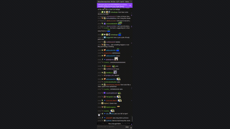
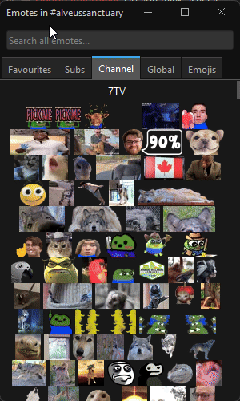
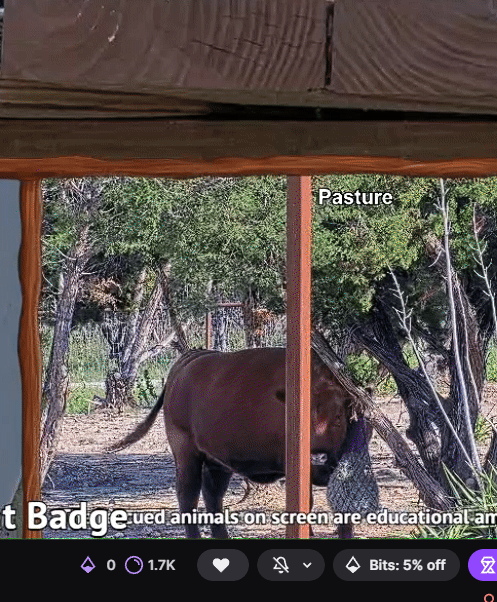

# ✨ Chatterino Better Browser

Current release: **2.6.0**

A fork of [Chatterino 2](https://github.com/Chatterino/chatterino2) that makes Twitch browser integration feel native and complete — Chatterino chat overlaid on Twitch, plus pinned messages, predictions, channel points, chat identity badges, and a richer emote input experience.

> 🧩 **One extension only** — load [`chatterino-extension/`](./chatterino-extension/) in Chrome or Edge. No separate Native Host or Companion install.

> [!IMPORTANT]
> Chatterino Better Browser stores settings locally in `%APPDATA%\Chatterino2\` and communicates only with Twitch and the services used for chat features. Its updater and first-run release notes point exclusively to this fork's [GitHub Releases](https://github.com/trinlol/chatterino-with-better-browser-integration/releases). Remove the unpacked browser extension and delete the extracted app folder to stop using the fork; your Chatterino settings remain untouched.

---

## 📸 Showcase

Chatterino Better Browser on a live Twitch channel — full chat in the overlay, synced pins, and toolbar integration beside the player.

<div align="center">

<table>
  <tr>
    <td rowspan="4" valign="top" align="center" width="50%">
      
      <br>
      <sub><b>Full chat preview</b> — pinned messages, inline input emotes, and ctrl+click to input emotes directly from user messages.</sub>
    </td>
    <td align="center" width="50%">
      
    </td>
  </tr>
  <tr>
    <td align="center" valign="top">
      <sub><b>Emote favourites</b> — save per-channel, global, and 7TV emotes with search and Tab completion.</sub>
    </td>
  </tr>
  <tr>
    <td align="center" width="50%">
      
    </td>
  </tr>
  <tr>
    <td align="center" valign="top">
      <sub><b>Channel points</b> — balance and rewards menu beside the player.</sub>
    </td>
  </tr>
</table>

</div>

<p align="center">
  <sub>Showcase captured on <a href="https://www.twitch.tv/alveussanctuary">alveussanctuary</a> for demonstration only.</sub>
</p>

---

## 🚀 Quick start (prebuilt)

1. 📦 Download the latest **Chatterino Better Browser Windows** archive from [Releases](https://github.com/trinlol/chatterino-with-better-browser-integration/releases/latest)
2. 🗑️ **Uninstall** the old Chatterino app from Windows if you have it _(your settings are safe — see below)_
3. 📂 Extract the zip **anywhere you like** (e.g. `C:\Apps\Chatterino Better Browser\`)
4. 🔗 Right-click **`Chatterino Better Browser.exe`** → **Send to** → **Desktop (create shortcut)** _(or pin to Start / taskbar)_
5. ▶️ Launch from your new shortcut
6. 🧩 Install the **one** browser extension below _(required)_
7. 🔄 Restart the app after loading the extension so native messaging registers

> 💡 **Already use Chatterino?** Your existing settings, accounts, and window layout load automatically — uninstalling the old app does **not** delete them. See [Settings & migration](#-settings--migration) below.

---

## 🎯 Features

### 🌐 Browser integration

- 📌 **Pinned messages** — moderator pins show as a compact purple banner in Chatterino with clickable links and a dismiss button
- 🗳️ **Clickable polls & predictions** — voting controls appear beside the Twitch player so you can vote without reopening native Twitch chat
- 🟢 **Accurate prediction banner** — the green Chatterino banner follows Twitch's real lock deadline instead of getting stuck at `2:00`
- 🧭 **Independent activity state** — polls and predictions update separately, with clearer titles and no cross-event overwrites
- 🪙 **Channel points auto-claim** — claims bonus chests automatically; scrollable rewards menu
- 🏅 **Chat identity button** — badge picker in the toolbar (left of channel points); opens Twitch's Chat Identity menu even when the native chat is hidden
- 🖥️ **Fullscreen-safe controls** — moved toolbar elements automatically hide while the Twitch video is fullscreen
- ⚡ **Stable browser overlay** — fixes flicker, disappearing chat, and runaway CPU from native messaging
- 🔄 **Fork-only updates** — update prompts and first-run release notes use this repository, never the upstream Chatterino download site

### 💬 Better emote input (fork-exclusive)

- 7️⃣ **7TV-only autocomplete** — both Tab completion and the visual `:` menu exclude Twitch, BTTV, FFZ, and emoji entries
- ⌨️ **Reliable Tab cycling** — press **Tab** or **Shift+Tab** to cycle forward or backward through matching 7TV emotes without losing your typed text
- 🔎 **Visual emote menu** — type `:` at the start of a word to browse 7TV emotes with previews; choosing one inserts editable text
- 🖼️ **Inline emotes in the input** — typed, completed, and clicked 7TV emotes render as images; Tab and Shift+Tab still cycle safely
- ⭐ **Emote favourites tab** — **Ctrl+click** any emote in chat to add it to your Favourites; open the emote picker to find them quickly
- 👆 **Click-to-type emotes** — click a single emote from another user's message to insert it straight into your input

### 👤 User card (fork-exclusive)

- 🏅 **Badges under avatar** — clicking a user shows their badges in a compact grid below the profile image
- 📜 **Paginated message history** — loads today's messages first, then older days on demand (skips empty days automatically)

---

## 📋 Todo

- [x] Fix text spacing on pinned announcements
- [ ] Add in-chat channel point messages (for message-based redemptions)
- [ ] Theme presets
- [x] Usercard — badges and paginated message history from channel logs

---

## 📁 Settings & migration

### ❓ Does this share config with regular Chatterino?

**Yes.** Chatterino Better Browser uses the **same settings location** as the official Chatterino 2 installer and portable builds:

| Mode                                                    | Config location          |
| ------------------------------------------------------- | ------------------------ |
| **Installed / zip (default)**                           | `%APPDATA%\Chatterino2\` |
| **Portable** (empty `portable` file next to the `.exe`) | Next to the executable   |

That folder contains everything: `Settings/settings.json`, accounts, window layout, favourite emotes, plugins, themes, and logs.

### 🔄 Switching from official Chatterino (recommended)

You do **not** need the official Chatterino installed to run this fork. Your settings live in `%APPDATA%\Chatterino2\` — **not** inside the old install folder — so uninstalling Chatterino is safe.

1. ⏹️ **Close** Chatterino completely
2. 🗑️ **Uninstall** the official Chatterino app from Windows _(Settings → Apps → Chatterino → Uninstall)_
   - ✅ Your splits, accounts, favourite emotes, themes, and window layout **stay saved** in `%APPDATA%\Chatterino2\`
3. 📥 Download and extract **Chatterino Better Browser** to **any folder** you want
4. 🔗 **Create a shortcut** — Desktop, Start, or taskbar
5. ▶️ Launch from your shortcut — everything loads from the same `settings.json` as before

### 📦 Portable vs installed

|          | Portable zip                      | Installed (future)                |
| -------- | --------------------------------- | --------------------------------- |
| Config   | `%APPDATA%\Chatterino2\` (shared) | `%APPDATA%\Chatterino2\` (shared) |
| Updates  | Re-download zip                   | Installer overwrites `.exe` only  |
| Best for | Trying the fork, no admin rights  | Daily driver, Start Menu shortcut |

---

## 🧩 Browser extension — one install

Everything runs through a **single** extension. Chat overlay, pins, channel points, chat identity, and predictions — no second extension needed.

1. 🌐 Open `chrome://extensions` or `edge://extensions`
2. 🔧 Enable **Developer mode**
3. 📂 Click **Load unpacked**
4. ✅ Select `browser-extension` from the downloaded Windows archive, or [`chatterino-extension`](./chatterino-extension/) when developing from source
5. 🧹 Remove any old **Native Host** or **Companion** extensions if you still have them loaded

See [`chatterino-extension/README.md`](./chatterino-extension/README.md) for popup settings and troubleshooting.

> ⚠️ **Tip:** After loading the extension for the first time, restart **Chatterino Better Browser** so the native messaging host manifest is registered with your browser.

---

## 🛠️ Build from source (Windows)

### 📋 Prerequisites

- Visual Studio 2022 or later with **Desktop development with C++**
- [Qt 6.8+](https://www.qt.io/download-open-source) (MSVC 64-bit kit)
- [Conan 2](https://conan.io/downloads.html)

Full details: [BUILDING_ON_WINDOWS.md](BUILDING_ON_WINDOWS.md)

### 🔨 Build commands

Open **x64 Native Tools Command Prompt for VS**, then:

```cmd
git clone --recurse-submodules https://github.com/trinlol/chatterino-with-better-browser-integration.git
cd chatterino-with-better-browser-integration
mkdir build
cd build
conan install .. -s build_type=Release -c tools.cmake.cmaketoolchain:generator="NMake Makefiles" --build=missing --output-folder=.
cmake -G"NMake Makefiles" -DCMAKE_BUILD_TYPE=Release -DCMAKE_TOOLCHAIN_FILE="conan_toolchain.cmake" -DCMAKE_PREFIX_PATH="C:\Qt\6.8.0\msvc2022_64" ..
cmake --build . --config Release
```

Output: `build/bin/Chatterino Better Browser.exe`

Deploy Qt runtimes:

```cmd
windeployqt "bin/Chatterino Better Browser.exe" --release --no-compiler-runtime --no-translations --no-opengl-sw --dir bin/
```

---

## 📂 Repository layout

| Path                                               | Description                                            |
| -------------------------------------------------- | ------------------------------------------------------ |
| [`src/`](./src/)                                   | 🖥️ Chatterino Better Browser C++ application           |
| [`chatterino-extension/`](./chatterino-extension/) | 🧩 Unified browser extension _(the only one you need)_ |
| [`lib/`](./lib/)                                   | 📚 Vendored dependencies (git submodules)              |
| [`resources/`](./resources/)                       | 🎨 Icons, themes, assets                               |
| [`docs/showcase/`](./docs/showcase/)               | 📸 README screenshots                                  |

---

## 📥 Clone

```shell
git clone --recurse-submodules https://github.com/trinlol/chatterino-with-better-browser-integration.git
```

---

## 🔗 Upstream links

- [Chatterino 2](https://github.com/Chatterino/chatterino2)
- [Chatterino Wiki](https://wiki.chatterino.com)
- [Original browser extension](https://github.com/Chatterino/chatterino-browser-ext)

---

<div align="center">

## Fork Curated By

<table>
  <tr>
    <td align="center" valign="top" width="200">
      <a href="https://chatgpt.com"></a><br />
      <sub><b>ChatGPT by OpenAI</b> — development, debugging, and documentation assistance</sub>
    </td>
  </tr>
</table>

</div>
