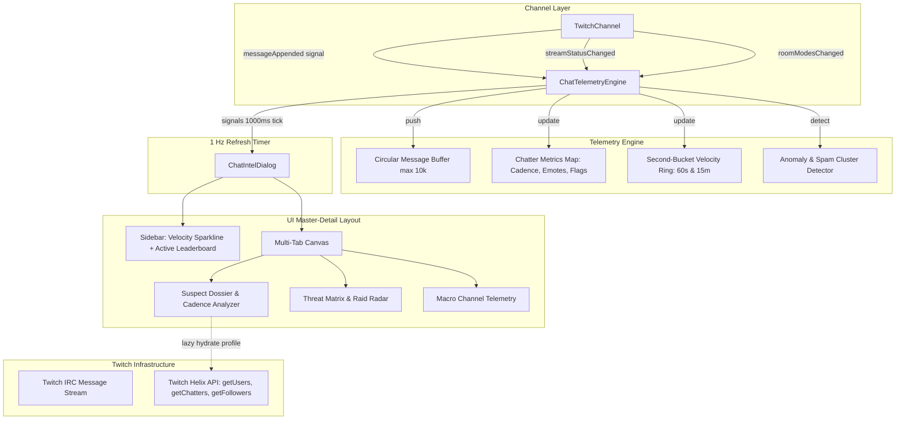

# Twitch Chat Intelligence & Telemetry Window - Plan

## Goal Capsule

- **Objective:** Implement a dedicated real-time intelligence and telemetry window for any attached Twitch chat channel in Chatterino, combining live velocity meters, a top-chatter leaderboard, individual suspect dossiers, and automated anomaly/raid detection.
- **Product Authority:** `ce-brainstorm` dialogue with the user settled on a Master-Detail Intelligence Console architecture with an in-memory rolling session buffer and adaptive native theming.
- **Product Contract Preservation:** Product Contract unchanged; enhanced with exhaustive Twitch Helix API and native chat metadata integration.
- **Open Blockers:** None.

---

## Product Contract

### Summary

A dedicated Master-Detail Twitch Chat Intelligence Window attached to a channel, featuring a persistent real-time velocity and top-chatter sidebar paired with an investigative canvas for individual chatter dossiers, anomaly/raid detection, and macro channel telemetry.

### Problem Frame

Chatterino power users, moderators, and streamers currently observe high-speed chat primarily as a single linear stream of text. When a raid, spam wave, or disruptive user occurs, determining chat velocity, identifying top active chatters, analyzing typing frequency, or isolating bot-like cadence requires external websites (such as SullyGnome or TwitchTracker) or cumbersome manual scrolling. There is no built-in, continuous, tactical telemetry tool within Chatterino that transforms raw IRC message streams into instant, actionable visual data.

### Key Decisions

- **Master-Detail Intelligence Console layout** (session-settled: user-directed — chosen over 4-Quadrant HUD & Modular Dockable Deck: Master-Detail Intelligence Console maximizes investigative depth without screen clutter). Governs R1, R2, R3, R4.
- **In-memory rolling session buffer** (session-settled: user-directed — chosen over persistent disk storage & full session memory: rolling in-memory buffer guarantees zero disk overhead and zero UI lag in high-velocity channels). Governs R5, R6.
- **Adaptive native Qt theming** (session-settled: user-directed — chosen over custom CIA HUD cyber theme: adaptive native Qt theming seamlessly inherits Chatterino's active palette, font settings, and DPI scaling). Governs R7.
- **Four-pillar comprehensive intelligence scope** (session-settled: user-directed — chosen over single-focus options: all 4 pillars included (Unified Ops Center, Macro Telemetry, Chatter Dossier, Anomaly/Threat Detection)). Governs R1 through R12.
- **Deep Twitch API & Native Chat Metadata Harvesting**: Maximize intelligence extraction by fusing real-time IRC message metadata (`serverReceivedTime`, badges, `badge-info` subscription months, external 7TV/FFZ/BTTV badges, message flags, emote elements) with asynchronous Helix API queries (`getUsers`, `getChatters`, `getStreams`, `getUserFollowAge`). Governs R6, R8, R9, R10.

### Requirements

**Window Frame & Navigation**

- R1. Provide a standalone `BaseWindow` / `DraggablePopup` dialog attached to a target Twitch channel split, accessible via the split header gear menu, configurable hotkey, and chat command `/intel`.
- R2. Render a persistent left sidebar containing real-time chat velocity (instantaneous messages/sec and messages/min) alongside a continuously updating leaderboard of the top active chatters.
- R3. Render a multi-tab investigative canvas in the main view area hosting three specialized panels: Suspect Dossier, Anomaly & Threat Matrix, and Macro Channel Telemetry.
- R4. Track channel lifecycle changes, updating metrics when the attached split changes channels and releasing resources when the window is closed.

**Telemetry & Data Processing**

- R5. Maintain an in-memory sliding ring buffer capturing recent messages (defaulting to the last 30 minutes or 10,000 messages) with bounded memory consumption and no disk persistence.
- R6. Compute continuous real-time statistics at sub-second intervals, including message velocity curves, unique active chatter counts, and text-to-emote volume ratios.
- R7. Integrate directly with Chatterino's native theme engine and DPI scaling, redrawing sparklines, gauges, and data tables on theme change.

**Suspect Profiler & Chatter Dossier**

- R8. Display an interactive dossier for any selected chatter, featuring total messages in window, typing cadence (inter-message interval average and variance), and top emotes used.
- R9. Display a chronological message history stream for the selected chatter within the rolling window, equipped with quick-action buttons for copying username and executing moderation commands.
- R10. Populate the chatter dossier with channel and Twitch identity metadata, including badges, account age, followage, and subscriber status.

**Anomaly & Threat Detection**

- R11. Provide automated raid and surge detection that flags sudden velocity spikes or unique chatter influxes exceeding a rolling statistical baseline.
- R12. Provide a copy-paste spam wave and bot-cluster analyzer that clusters duplicate or near-duplicate messages across multiple chatters and highlights unnaturally regular typing intervals.

### Key Flows

- F1. Launching Intelligence Window
  - **Trigger:** User clicks "Channel Intelligence" in split header menu, triggers the `/intel` command, or presses the assigned hotkey.
  - **Actors:** User, Split, Intelligence Window.
  - **Steps:** Window opens initialized with the current split's `TwitchChannel`. The rolling message listener attaches to the channel's `messageAppended` signal and populates initial metrics from existing channel scrollback.
  - **Covers:** R1, R4, R5.

- F2. Investigating a Suspect Chatter
  - **Trigger:** User clicks a username in the top-chatter leaderboard or clicks "Track in Intel" on a chat message context menu.
  - **Actors:** User, Suspect Profiler Panel.
  - **Steps:** The main canvas switches to the "Suspect Dossier" tab. The user's typing cadence, interval variance (clock-like bot detection indicator), top emotes, and recent messages are rendered immediately. Asynchronous Helix calls hydrate avatar, account creation date, and followage.
  - **Covers:** R2, R3, R8, R9, R10.

- F3. Detecting and Inspecting a Spam Surge or Raid
  - **Trigger:** Influx of rapid messages triggers the rolling baseline threshold.
  - **Actors:** Anomaly Engine, Threat Matrix Panel.
  - **Steps:** The sidebar velocity indicator flashes an amber/red surge badge. The user opens the Threat Matrix tab to inspect clustered repetitive phrases and the list of participating accounts.
  - **Covers:** R2, R3, R6, R11, R12.

### Acceptance Examples

- AE1. High-Velocity Surge
  - **Covers:** R5, R6, R11.
  - **Given:** The intelligence window is open on a channel receiving 150 messages/sec during an intense stream moment.
  - **When:** Messages stream into the rolling buffer.
  - **Then:** UI rendering remains responsive, chat velocity meter updates smoothly without dropping frames or freezing Chatterino's main chat view, and memory usage remains capped at the buffer limit.

- AE2. Bot Cadence Flagging
  - **Covers:** R8, R12.
  - **Given:** A chatter or set of accounts sends automated messages every 15.0 seconds ± 0.05s.
  - **When:** The chatter is selected in the Suspect Dossier or analyzed in the Threat Matrix.
  - **Then:** The typing cadence variance is identified as near-zero and flagged with a "Regular Cadence / Potential Bot" indicator.

- AE3. Channel Switch & Cleanup
  - **Covers:** R1, R4.
  - **Given:** The intelligence window is attached to `#channel_a`.
  - **When:** The user reassigns the parent split to `#channel_b` or closes the window.
  - **Then:** The window detaches its signal listeners from `#channel_a`, clears the rolling buffer, attaches to `#channel_b`, and releases previous channel data from memory.

### Scope Boundaries

**In-Scope:**
- Real-time channel telemetry, velocity sparklines, and active chatter leaderboard.
- Target chatter dossier with cadence analysis, top emotes, and message intercept history.
- Full Twitch Helix metadata hydration (account age, avatar, followage, total chatters).
- Native chat metadata inspection (`badge-info` sub months, 3rd-party emotes/badges, message flags).
- Anomaly, spam wave, and raid detection based on rolling message baselines.
- Single-channel attachment with rolling in-memory buffer.
- Native Chatterino theme and DPI integration.

**Deferred / Outside Product Identity:**
- Cross-session disk storage and SQLite database persistence (kept in-memory for zero disk footprint).
- Cross-channel global chatter tracking across Twitch networks.
- Autonomous moderation bots (moderation actions remain manual user clicks).

### Success Criteria

- **Real-Time Performance:** Velocity meters and chat metrics update continuously at 1 Hz without degrading Chatterino's primary chat rendering or typing latency.
- **Memory Boundedness:** The rolling buffer maintains a strict memory cap (e.g. max 10,000 messages / ~15MB memory) regardless of stream duration.
- **Investigative Utility:** A user can identify the top chatter and review their typing rhythm, favorite emotes, and recent messages in under 2 clicks.
- **Data Completeness:** Chatter dossiers incorporate both native IRC message elements (badges, emote frequencies, flags) and Twitch Helix API stats (account creation date, avatar, followage).

---

## Planning Contract

### Key Technical Decisions

- KTD1. **Decoupled Telemetry Engine (`ChatTelemetryEngine`)**: Centralize statistical analysis and message ring buffer in a standalone QObject engine that hooks `Channel::messageAppended`. Avoids cluttering `TwitchChannel` with UI-specific analytics. Governs R4, R5, R6.
- KTD2. **Lightweight Custom `QPainter` Sparklines (`SparklineWidget`)**: Render velocity history curves using native `QPainter` in `paintEvent` rather than linking heavyweight charting libraries. Ensures sub-millisecond redraw, zero external dependency bloat, and instant reaction to DPI scale changes. Governs R6, R7.
- KTD3. **Circular Ring Buffers for Fixed-Memory Bounds**: Utilize `boost::circular_buffer` (already available in Chatterino) for recent messages and per-second message rate buckets (e.g. 60-second and 15-minute windows), enforcing strict $O(1)$ updates and zero heap reallocations during high velocity. Governs R5, R6.
- KTD4. **Cadence Analysis via Welford's Variance Algorithm**: Maintain running mean and variance of inter-message timestamps for active chatters in $O(1)$ time. A near-zero variance directly signals synthetic / bot clockwork behavior. Governs R8, R12.
- KTD5. **Dual-Tier Data Hydration (Instant IRC + Async Helix)**: Instantly populate chatter telemetry from IRC tags (`serverReceivedTime`, `badge-info`, badges, emote elements, message flags) on arrival, and lazily hydrate Twitch account profile data via `Helix::getUserById` and `Helix::getUserFollowAge` when a chatter is inspected in the dossier. Governs R8, R10.
- KTD6. **1 Hz Decoupled UI Refresh Timer**: Decouple packet ingestion from UI repainting. Ingestion occurs on `messageAppended`; a dedicated 1 Hz `QTimer` batches UI view updates and leaderboard sorting, preventing UI thrashing even at 500+ msgs/sec. Governs R2, R6.

### High-Level Technical Design

---

## Implementation Units

### U1. Telemetry Processing Engine & Circular Buffers

- **Goal:** Build `ChatTelemetryEngine`, an in-memory analytics processor that ingests messages from `Channel::messageAppended`, extracts rich native message telemetry (emotes, badges, sub months, flags), computes rolling velocity buckets, maintains chatter activity stats, and tracks inter-message intervals.
- **Requirements:** R4, R5, R6, R8, R10.
- **Dependencies:** None.
- **Files:**
  - `src/controllers/intelligence/ChatTelemetryEngine.hpp`
  - `src/controllers/intelligence/ChatTelemetryEngine.cpp`
  - `src/controllers/intelligence/ChatterProfile.hpp`
  - `src/CMakeLists.txt`
  - `tests/src/ChatTelemetryEngine.cpp`
- **Approach:**
  1. Define `ChatterProfile` struct tracking:
     - Identification: `userID`, `loginName`, `displayName`, `color`.
     - Activity stats: total message count, first and last seen timestamps (`serverReceivedTime`), average interval, and interval variance (via Welford's algorithm).
     - Linguistic & emote profile: map of emote occurrences (Twitch, BTTV, FFZ, 7TV), total emote count vs text characters, cheer bit counts.
     - Status badges: Twitch subscriber tier & tenure months parsed from `badge-info`, founder, VIP, moderator, verified, external badges (`7tv`, `bttv`, `ffz`).
     - Behavioral flags: count of highlighted messages, action messages (`/me`), first-time chat flags.
  2. Implement `ChatTelemetryEngine` inheriting `QObject` with a `boost::circular_buffer<MessageTelemetryEntry>` bounded to 10,000 items.
  3. Maintain two velocity ring buffers: 60 seconds (1-second resolution) and 15 minutes (5-second resolution).
  4. Connect to `channel->messageAppended` and process messages without blocking the GUI thread.
  5. Provide querying methods: `messagesPerSecond()`, `messagesPerMinute()`, `topChatters(int count)`, `getChatterProfile(QString user)`.
- **Patterns to follow:** `src/common/ChannelChatters.hpp` for chatter storage and `src/messages/LimitedQueue.hpp` for queue patterns.
- **Test scenarios:**
  - Ingestion adds messages to ring buffer up to 10,000 and rolls over oldest entries.
  - Instantaneous messages-per-second accurately reflects messages within the last 1000ms.
  - `ChatterProfile` extracts badges, subscriber duration, and computes correct mean and variance for inter-message arrival times.
- **Verification:** Unit tests in `tests/src/ChatTelemetryEngine.cpp` pass and report correct velocity and chatter cadence.

---

### U2. High-Performance Sparkline & Telemetry Widgets

- **Goal:** Implement `SparklineWidget` and telemetry gauge widgets using custom `QPainter` drawing to render smooth, anti-aliased velocity curves and rate indicators.
- **Requirements:** R6, R7.
- **Dependencies:** U1.
- **Files:**
  - `src/widgets/dialogs/intelligence/SparklineWidget.hpp`
  - `src/widgets/dialogs/intelligence/SparklineWidget.cpp`
  - `src/CMakeLists.txt`
- **Approach:**
  1. Create `SparklineWidget` subclassing `BaseWidget`.
  2. In `paintEvent`, draw an anti-aliased polyline over the historical second-buckets with gradient fill beneath the curve.
  3. Support configurable time horizons (60s, 5m, 15m) and threshold marker lines for baseline vs surge rates.
  4. Query colors dynamically from `Theme::instance()` (`accent`, `window.text`, `tabs.selected.background`) and scale stroke widths according to DPI (`getScale()`).
- **Patterns to follow:** `src/widgets/splits/PinnedMessageWidget.cpp` and `src/widgets/helper/LiveIndicator.cpp` for `QPainter` and `Theme` integration.
- **Test scenarios:**
  - Empty sparkline handles zero data points cleanly without division by zero.
  - Sparkline dynamically normalizes vertical scale to peak message velocity within the window.
  - Theme change signal updates brush and pen colors immediately.
- **Verification:** Widget renders test data cleanly in test window and adapts to light/dark theme switches.

---

### U3. Suspect Profiler & Chatter Dossier Panel (with Helix & IRC Fusion)

- **Goal:** Implement the Suspect Dossier canvas and top-chatter leaderboard, fusing instant IRC chatter data with Twitch Helix API profile metadata (account age, avatar, followage).
- **Requirements:** R2, R8, R9, R10.
- **Dependencies:** U1, U2.
- **Files:**
  - `src/widgets/dialogs/intelligence/ChatterLeaderboardWidget.hpp`
  - `src/widgets/dialogs/intelligence/ChatterLeaderboardWidget.cpp`
  - `src/widgets/dialogs/intelligence/SuspectDossierWidget.hpp`
  - `src/widgets/dialogs/intelligence/SuspectDossierWidget.cpp`
  - `src/CMakeLists.txt`
- **Approach:**
  1. `ChatterLeaderboardWidget`: QTableWidget or custom ListView displaying rank, user color pill, username, badges, message count, and cadence rating. Emits `chatterSelected(QString)`.
  2. `SuspectDossierWidget`:
     - Identity strip: Chatter color, display name, user ID, Twitch badges (sub months, mod, VIP, etc.).
     - Asynchronous Helix hydration: Query `Helix::getUserById` for avatar image, account creation date, and `Helix::getUserFollowAge` for followage in channel.
     - Cadence analysis: Displays mean interval between messages and cadence variance. Flags regular clockwork behavior (< 0.2s variance) as "Potential Automated Bot".
     - Emote & vocabulary repertoire: Top 5 most frequently typed emotes/words with occurrence percentages.
     - Intercept log: Chronological message stream for the user in the session window, with quick moderation buttons: Timeout (1s, 1m, 10m), Ban, Copy Username, and Open Usercard.
- **Patterns to follow:** `src/widgets/dialogs/UserInfoPopup.cpp` for Helix data fetching, avatar loading, and moderation action buttons.
- **Test scenarios:**
  - Selecting a chatter updates dossier with their specific message log, badge breakdown, and statistics.
  - A chatter with clockwork intervals (e.g. 10.0s, 10.0s, 10.0s) displays a "Clockwork Cadence (Bot Alert)" tag.
  - Helix profile details (avatar, created date) populate asynchronously without freezing UI.
  - Moderation action buttons emit appropriate commands to the underlying channel.
- **Verification:** Clicking chatters in leaderboard displays correct historical messages, cadence breakdown, and hydrated Twitch profile data.

---

### U4. Anomaly & Threat Detection Matrix

- **Goal:** Implement `ThreatMatrixWidget` and anomaly algorithms to flag velocity surges (raids), copy-paste spam swarms, and bot networks in real time.
- **Requirements:** R11, R12.
- **Dependencies:** U1, U2.
- **Files:**
  - `src/controllers/intelligence/AnomalyDetector.hpp`
  - `src/controllers/intelligence/AnomalyDetector.cpp`
  - `src/widgets/dialogs/intelligence/ThreatMatrixWidget.hpp`
  - `src/widgets/dialogs/intelligence/ThreatMatrixWidget.cpp`
  - `src/CMakeLists.txt`
  - `tests/src/AnomalyDetector.cpp`
- **Approach:**
  1. `AnomalyDetector`:
     - Maintain rolling baseline (mean + standard deviation of messages/sec over a 5-minute window). If current 5-second rate exceeds 3 standard deviations, flag a Surge / Raid event.
     - Hash normalized message strings (ignoring whitespace and case). Track frequency of duplicate phrases across distinct usernames in the last 60 seconds. Messages repeated by 3+ distinct users are flagged as Spam Wave Clusters.
  2. `ThreatMatrixWidget`:
     - Top section: Current threat condition indicator (Normal / Elevated / Surge / Raid Alert).
     - Middle section: Active Spam Clusters table displaying repeated message text, repetition count, and list of involved accounts.
     - Bottom section: List of flagged suspect accounts exhibiting automated clockwork intervals.
- **Patterns to follow:** `src/common/LinkParser.cpp` and `src/util/QStringHash.hpp`.
- **Test scenarios:**
  - Multiple users sending the same copypasta within 10 seconds triggers a Spam Cluster alert.
  - Normal chat velocity changes (gradual rise) do not trigger false-positive raid warnings.
  - Abrupt jump from 5 msgs/sec to 100 msgs/sec triggers immediate Surge Alert.
- **Verification:** Unit tests in `tests/src/AnomalyDetector.cpp` verify cluster detection and threshold sensitivity.

---

### U5. Dialog Shell, Split Attachment & Navigation Integration

- **Goal:** Assemble the complete Master-Detail Intelligence Console (`ChatIntelDialog`), wire into `Split`, add split header menu action, hotkey, and `/intel` chat command.
- **Requirements:** R1, R3, R4, R7.
- **Dependencies:** U1, U2, U3, U4.
- **Files:**
  - `src/widgets/dialogs/intelligence/ChatIntelDialog.hpp`
  - `src/widgets/dialogs/intelligence/ChatIntelDialog.cpp`
  - `src/widgets/splits/Split.hpp`
  - `src/widgets/splits/Split.cpp`
  - `src/widgets/splits/SplitHeader.cpp`
  - `src/controllers/commands/builtin/Misc.cpp`
  - `src/CMakeLists.txt`
- **Approach:**
  1. `ChatIntelDialog`: Inherits `BaseWindow` (with `EnableCustomFrame`). Layout consists of:
     - Left pane: `SparklineWidget` (velocity) + `ChatterLeaderboardWidget`.
     - Right pane: `QTabWidget` with tabs: "Suspect Dossier", "Threat Matrix", "Macro Analytics".
  2. Timer tick: 1 Hz `QTimer` drives update cycles.
  3. Split lifecycle: Store `QPointer<ChatIntelDialog>` in `Split`. If the split changes channel, invoke `dialog->attachChannel(newChannel)`. Closing split closes dialog.
  4. Split header: Add "Channel Intelligence..." under TwitchChannel actions in `SplitHeader::createMainMenu()`.
  5. Command: Register `/intel` in `Misc.cpp` to open `ChatIntelDialog` for the active split.
- **Patterns to follow:** `src/widgets/splits/Split.cpp` for popup management and `src/controllers/commands/builtin/Misc.cpp` for command registration.
- **Test scenarios:**
  - Clicking "Channel Intelligence..." in split header opens dialog attached to split's channel.
  - Running `/intel` in split chat input opens dialog.
  - Changing channel in split cleanly updates the open dialog to the new channel.
  - Closing split closes or cleanly detaches dialog without crash.
- **Verification:** Dialog launches cleanly, attaches to channel, displays live data at 1 Hz, and respects theme changes.

---

## System-Wide Impact

- **Memory & Resource Boundedness:** Circular buffers cap memory usage to a maximum of 10,000 message pointers (~10-15 MB memory per dialog). Closing the dialog immediately reclaims buffer allocations.
- **UI Thread Latency:** Statistical calculations and string hashing operate strictly within lightweight $O(1)$ operations on message arrival. Heavy UI sorting and sparkline repaints are throttled to a 1 Hz timer, guaranteeing zero typing latency degradation in main chat.
- **Build System:** All new files reside in `src/controllers/intelligence/` and `src/widgets/dialogs/intelligence/`, registered cleanly in `src/CMakeLists.txt`. Uses existing Qt6 Gui/Widgets and Boost headers without new external library dependencies.

---

## Risk Analysis & Mitigation

- **Risk:** Extreme raid velocity (e.g. 500+ messages/sec) could overwhelm the UI thread if repainting on every message.
  - **Mitigation:** Ingestion only updates internal atomic counters and circular buffers; UI repainting is strictly throttled to the 1 Hz timer tick.
- **Risk:** Channel switching or split closing could cause dangling pointer dereferences.
  - **Mitigation:** Use `QPointer<ChatIntelDialog>` and listen to `Channel::destroyed` / `Split::channelChanged` signals to detach cleanly.

---

## Definition of Done

- All 5 Implementation Units are implemented and registered in `src/CMakeLists.txt`.
- Unit tests for `ChatTelemetryEngine` and `AnomalyDetector` build and pass.
- Intelligence console opens via Split header menu and `/intel` command.
- Live messages update velocity sparklines, chatter leaderboard, suspect dossiers, and threat matrix in real time.
- Dialog respects theme switches and scaling without memory leaks.
