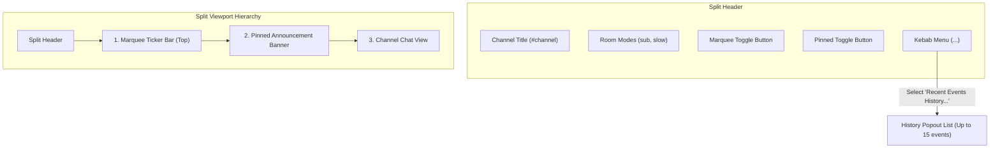
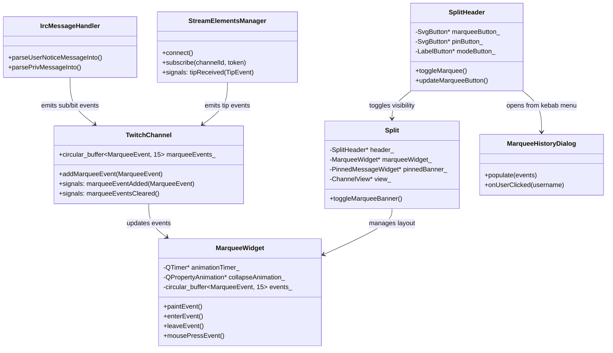

# Twitch Subs, Bits & Tips Marquee Ticker - Plan

## Goal Capsule

- **Objective:** Add a 1-line real-time marquee ticker above the pinned announcement in Chatterino splits to display recent Twitch subscriptions, cheer bits, and StreamElements tips per channel.
- **Product Authority:** `ce-brainstorm` dialogue with user.
- **Open Blockers:** None.

---

## Product Contract

### Summary

This feature introduces a 1-line real-time event marquee ticker to Chatterino split views, positioned directly above the pinned announcement banner. The ticker continuously showcases recent channel support events—Twitch subscriptions, cheer bits, and StreamElements donation tips—complete with channel badges, cheered bit icons, and tip amounts. It features an integrated split header toggle button (enabled by default), steady-speed smooth scrolling with pause-on-hover, a 15-event retention buffer, and a popout history list accessible via the split's kebab menu.

### Problem Frame

Viewers and streamers using Chatterino frequently miss subscriptions, bits, and donation milestones when chat moves rapidly or when watching in compact split configurations. While pinned announcements provide static notices, there is currently no compact, dedicated, ambient visual ticker for incoming support events. Users must either clutter their screen with external browser overlays or parse raw chat text. Introducing a lightweight, native, collapsible 1-line ticker provides ambient awareness without sacrificing chat real estate.

### Key Decisions

- KD1. **Top bar placement above pinned announcement with slide collapse** (session-settled: user-directed — chosen over placement below pinned announcement: ensures consistent hierarchy where persistent channel support anchors the top and pinned message sits immediately below). Governs R1, R2, R3.
- KD2. **Removal of "follow" room mode text from split header to fit marquee button** (session-settled: user-directed — chosen over adding another button to an overcrowded header: recovers space cleanly without losing other critical room modes). Governs R4, R5.
- KD3. **Continuous ribbon marquee (Option A) default with Event Chips (Option C) setting** (session-settled: user-directed — chosen over step carousel: provides the classic ticker aesthetic while offering a calmer multi-pill alternative in settings). Governs R6, R7, R8.
- KD4. **Constant scroll speed regardless of event count** (session-settled: user-directed — chosen over fixed-duration loop: prevents high-volume event bursts from accelerating the ticker into an unreadable blur). Governs R9.
- KD5. **15-event memory buffer per channel** (session-settled: user-directed — chosen over uncapped or small 5-event queue: preserves recent momentum while bounding memory usage). Governs R10, R11.
- KD6. **Popout history list accessed via Split kebab menu** (session-settled: user-directed — chosen over an on-bar icon or header click: keeps the top bar minimal while providing full access to recent event history). Governs R12, R13.
- KD7. **Universal Twitch IRC tags for subs/bits, optional StreamElements Astro WS for tips** (session-settled: user-approved — chosen over broadcaster-only EventSub: works out of the box on all channels without broadcaster OAuth, while supporting tips via StreamElements token). Governs R14, R15, R16.



### Actors

- A1. **Chatterino Viewer**: Views the marquee ticker in active splits, pauses on hover to read, clicks usernames to inspect usercards, and toggles the ticker on/off via the split header button.
- A2. **Broadcaster / Moderator**: Manages channel splits and inspects recent support history via the split kebab menu.
- A3. **Twitch IRC Gateway**: Emits real-time `USERNOTICE` tags for subs/resubs/gifts and `PRIVMSG` tags for cheers/bits.
- A4. **StreamElements Astro Gateway**: Emits real-time `channel.tips` JSON payloads over TLS WebSocket when configured with an account/overlay token.

### Requirements

#### Split Header & Layout

- R1. The marquee ticker widget must be positioned directly beneath the `SplitHeader` and immediately above the `PinnedMessageWidget` (`pinnedBanner_`) in the split layout.
- R2. The marquee toggle button must be rendered in `SplitHeader` adjacent to the pinned message toggle button (`pinButton_`).
- R3. The marquee toggle button must default to active (on); when toggled off, the marquee bar must collapse upwards, with the pinned announcement banner (or chat view) sliding up into its place.
- R4. The "follow" room mode indicator (e.g. `follow, ` or `follow(15m), `) must be removed from the split header room mode label to provide layout room for the new button.
- R5. The follower mode command trigger (`/followers`, `/followersoff`) in the room mode popup menu must remain intact.

#### Marquee Presentation & Motion

- R6. By default, the marquee ticker must render events as a continuous horizontal ribbon (Option A) scrolling smoothly from right to left.
- R7. Hovering the mouse cursor anywhere over the marquee bar must pause the scrolling animation immediately, resuming when the cursor leaves.
- R8. A user preference in Chatterino Settings must allow switching the display style to Event Chips Stream (Option C), displaying the latest 3–4 events side-by-side.
- R9. The marquee scroll speed must be calculated at a constant pixel-per-second rate, maintaining uniform speed regardless of the number of buffered events.

#### Event Retention & History

- R10. Each channel split must maintain a dedicated circular buffer holding up to 15 of the most recent events (subscriptions, bits cheers, and tips).
- R11. Buffered events must be strictly isolated per channel; switching tabs, channels, or splits must not leak events from one channel to another.
- R12. The split header kebab dropdown menu must include a "Recent Events History..." action.
- R13. Triggering "Recent Events History..." must display a popout window or menu listing the buffered events chronologically with event badge, username, amount/tier, timestamp, and optional user message. Clicking any username in the ticker or history list must open their standard Chatterino usercard.

#### Event Ingestion & Badge Resolution

- R14. The system must ingest first-time subscriptions (`msg-id=sub`), renewals (`msg-id=resub`), single gift subs (`msg-id=subgift`), and community gift bombs (`msg-id=submysterygift`) from Twitch IRC `USERNOTICE` messages.
- R15. The system must ingest bits cheers from Twitch IRC `PRIVMSG` messages containing `bits` tags.
- R16. When a StreamElements JWT or API overlay token is configured in Settings, the system must connect to `wss://astro.streamelements.com/` and ingest real-time `channel.tips` events for the matching channel.
- R17. For subscription events, the marquee item must resolve and display the user's channel subscriber badge corresponding to their tier and tenure months.
- R18. For bits cheer events, the marquee item must resolve and display the channel's custom bits badge or global Twitch bits gem corresponding to the cheer threshold, along with the cheer amount.

#### Settings & User Preferences

- R19. A setting in Settings → General / Split must provide a global default for whether the marquee bar starts visible or hidden.
- R20. A setting in Settings → Look & Feel must provide a dropdown to choose the ticker style (`Continuous Ribbon (Default)` or `Event Chips Stream`).
- R21. A setting in Settings → Look & Feel must provide a slider or input for ticker scroll speed (e.g. 20 to 80 px/sec).
- R22. A secure input field in Settings → Integrations must allow configuring the StreamElements JWT or overlay token, with token masking and streamer mode protection.

### Key Flows

- F1. **Live Subscription or Cheer Event in Channel**
  - **Trigger:** Twitch IRC sends `USERNOTICE` (sub/resub/gift) or `PRIVMSG` (bits).
  - **Actors:** A1, A3
  - **Steps:** IRC message handler extracts user, tier/months/bits count, and badge tags; resolves badge icon from `TwitchChannel`; pushes event into the channel's 15-item buffer; marquee updates and scrolls the new event into view.
  - **Outcome:** New event appears seamlessly in the channel's marquee.
  - **Covered by:** R6, R9, R10, R14, R15, R17, R18

- F2. **StreamElements Tip Ingestion**
  - **Trigger:** StreamElements Astro WebSocket emits `channel.tips` payload.
  - **Actors:** A1, A4
  - **Steps:** Payload parsed for username, numeric amount, and ISO currency code; formatted locally into currency string (e.g., `$10.00`); pushed to matching channel buffer with tip coin badge.
  - **Outcome:** Tip appears in the marquee alongside native Twitch events.
  - **Covered by:** R6, R10, R16

- F3. **Toggling Ticker Visibility**
  - **Trigger:** User clicks marquee toggle button in `SplitHeader`.
  - **Actors:** A1
  - **Steps:** Button active state toggles; marquee widget triggers collapse/expand animation; pinned banner and chat view shift vertically to occupy the reclaimed space.
  - **Outcome:** Clean collapse/restore without layout glitches.
  - **Covered by:** R2, R3

- F4. **Inspecting History List**
  - **Trigger:** User opens split kebab menu and clicks "Recent Events History...".
  - **Actors:** A1, A2
  - **Steps:** Popout dialog opens displaying the 15 buffered items with full details; user clicks a username.
  - **Outcome:** Usercard dialog opens for the selected user.
  - **Covered by:** R10, R12, R13

### Acceptance Examples

- AE1. **Event Burst Handling**
  - **Covers R9, R10.**
  - **Given:** A streamer receives a 10-sub community mystery gift bomb followed by 5 cheer messages within 3 seconds.
  - **When:** The events are ingested into the channel buffer.
  - **Then:** The buffer holds the latest 15 events, dropping older ones beyond 15, and the marquee continues scrolling at the configured steady rate (e.g. 35 px/sec) without sudden speed surges.

- AE2. **Layout Order with Pinned Message Active**
  - **Covers R1, R2, R3.**
  - **Given:** A channel has an active pinned announcement message and the marquee ticker is visible.
  - **When:** The user observes the split layout.
  - **Then:** The marquee bar sits directly above the pinned announcement. When the marquee is toggled off, it slides upward and the pinned message sits directly below the split header.

- AE3. **Channel Isolation on Split Switch**
  - **Covers R11.**
  - **Given:** Split 1 is set to `#channelA` with 10 recent subs, and Split 2 is set to `#channelB` with 0 recent events.
  - **When:** The user interacts with Split 2.
  - **Then:** Split 2 shows no events from `#channelA`; its buffer contains only `#channelB` events.

- AE4. **Username Usercard Interaction**
  - **Covers R13.**
  - **Given:** The marquee or history popout displays an event from user `TwitchPro99`.
  - **When:** The user left-clicks the name `TwitchPro99`.
  - **Then:** The standard Chatterino usercard for `TwitchPro99` opens, showing badges, timeout/ban moderation buttons, and user history.

- AE5. **StreamElements Token Absence**
  - **Covers R15, R16.**
  - **Given:** No StreamElements token is configured in Settings.
  - **When:** The user joins any channel.
  - **Then:** Native Twitch subs and bits function normally with zero warnings, errors, or failed connection popups.

### Scope Boundaries

#### Deferred for later

- Support for other 3rd-party tip providers (Streamlabs, Tiltify, PayPal).
- Sound alert notifications or custom audio effects on marquee event arrival.
- Custom filtering rules (e.g., minimum bit threshold or minimum tip amount to appear on the marquee).

#### Outside this product's identity

- Full-screen OBS overlay rendering or web broadcast overlays (Chatterino is an ambient desktop chat client, not an overlay rendering server).
- Direct payment processing or donor management.

### Dependencies / Assumptions

- **Twitch IRC Tags:** Assumes standard Twitch IRC `USERNOTICE` tags (`msg-id=sub`, `resub`, `subgift`, `submysterygift`) and `PRIVMSG` `bits` tags remain active and supported.
- **Badge Cache:** Relies on Chatterino's existing `TwitchChannel::twitchBadge()` and `TwitchBadges::badge()` resolution routines.
- **Astro WebSocket Stability:** Assumes StreamElements `wss://astro.streamelements.com/` remains available for standard RFC 6455 connections.
- **Qt Layout:** Assumes standard Qt `QVBoxLayout` resize behavior in `Split` with smooth widget height transitions.

### Sources / Research

- SplitHeader layout & button definitions: `src/widgets/splits/SplitHeader.cpp` (lines 313–453, 831–874).
- Split vertical layout hierarchy: `src/widgets/splits/Split.cpp` (lines 95–116).
- Pinned announcement widget: `src/widgets/splits/PinnedMessageWidget.hpp` and `.cpp`.
- Twitch IRC subscription notices: `src/providers/twitch/IrcMessageHandler.cpp` (lines 718–888).
- Twitch Bits cheer handling: `src/messages/MessageBuilder.cpp` (lines 1840–2010).
- Twitch badge resolution: `src/providers/twitch/TwitchChannel.cpp` (lines 1895–1969, 2396–2410) and `src/providers/twitch/TwitchBadges.cpp`.
- StreamElements Astro WebSocket specification: `wss://astro.streamelements.com/` topic `channel.tips`.

---

## Planning Contract

### Key Technical Decisions

- KTD1. **Data Model in `TwitchChannel` with Signal Dispatch**
  - **Rationale:** Storing the `MarqueeEventBuffer` (circular ring buffer of 15 `MarqueeEvent` structs) inside `TwitchChannel` guarantees that channel event history persists when splits are unfocused, tabs are switched, or splits are cloned. `TwitchChannel` emits `marqueeEventAdded(const MarqueeEvent &)` which connected `MarqueeWidget` instances consume.
  - **Governs:** R10, R11.

- KTD2. **Paint-Event Driven Ticker with Fixed-Frame Animation Timer**
  - **Rationale:** Qt widgets scrolling text/images smoothly require double-buffered painting in `paintEvent(QPaintEvent *)`. A single `QTimer` (firing at 60 FPS, ~16ms) increments an offset float `pixelOffset_ += (speedPixelsPerSec * deltaTime)`. This avoids heavy QGraphicsView overhead and integrates seamlessly with Chatterino's `Theme` and `Scale` DPI handling.
  - **Governs:** R6, R7, R9.

- KTD3. **`QPropertyAnimation` for Collapsible Slide Transition**
  - **Rationale:** To achieve the smooth upward slide when toggled off, `MarqueeWidget` exposes a `maximumHeight` property animated via `QPropertyAnimation(this, "maximumHeight")` over 250ms (easing curve `QEasingCurve::InOutQuad`). When reaching 0, it calls `hide()`; when toggled on, it calls `show()` and animates from 0 up to 28 * scale.
  - **Governs:** R1, R3.

- KTD4. **StreamElements Astro WebSocket Integration via Boost.Beast**
  - **Rationale:** StreamElements Astro Gateway uses standard RFC 6455 WebSockets over TLS (`wss://astro.streamelements.com/`) with JSON subscriptions. Chatterino already has `WebSocketPool` built on Boost.Asio/Beast (used by 7TV and BTTV). A new `StreamElementsManager` will reuse this pattern, eliminating third-party Socket.io dependencies.
  - **Governs:** R16, R22.

- KTD5. **Room Mode Layout Simplification**
  - **Rationale:** In `src/widgets/splits/SplitHeader.cpp`, modifying `formatRoomModeUnclean` to omit the `modes->followerOnly` string from the mode label string recovers 30–60px of horizontal space. The "Followers only" configuration dialog in `createChatModeMenu()` remains completely untouched.
  - **Governs:** R4, R5.

### System Architecture



---

## Implementation Units

### U1. SplitHeader Follow Text Removal & Marquee Toggle Button

- **Goal:** Free up header horizontal space by removing the follower mode text indicator and add a new `marqueeButton_` with SVG icon in `SplitHeader`, wired to toggle the split's marquee bar.
- **Files to modify:**
  - `src/widgets/splits/SplitHeader.hpp`
  - `src/widgets/splits/SplitHeader.cpp`
  - `resources/buttons/marquee.svg` (New asset)
- **Patterns to follow:** Existing `pinButton_` pattern in `SplitHeader` (lines 331–341, 431–433, 936–955).
- **Test Scenarios:**
  - When a channel is in follower mode, the header mode text does not display `follow`, but clicking `modeButton_` still shows follower mode status and actions.
  - The marquee toggle button renders next to `pinButton_` with tooltip "Toggle recent events marquee".
  - Left-clicking `marqueeButton_` toggles its active color and calls `split_->toggleMarqueeBanner()`.
- **Verification:** Unit test & manual inspection of header buttons in various window widths.

### U2. Channel Event Model & Twitch IRC Ingestion

- **Goal:** Create `MarqueeEvent` data structure, attach a 15-event circular buffer to `TwitchChannel`, and feed it from Twitch IRC `USERNOTICE` (subs, resubs, gifts) and `PRIVMSG` (bits).
- **Files to modify / create:**
  - `src/providers/twitch/MarqueeEvent.hpp` (New file)
  - `src/providers/twitch/TwitchChannel.hpp`
  - `src/providers/twitch/TwitchChannel.cpp`
  - `src/providers/twitch/IrcMessageHandler.cpp`
  - `src/messages/MessageBuilder.cpp`
- **Patterns to follow:** `TwitchChannel::twitchBadge()` lookup; `boost::circular_buffer` or `std::deque` capped at 15.
- **Test Scenarios:**
  - Receiving `msg-id=sub` or `resub` parses tier, months, user display name, and channel sub badge into `MarqueeEvent`.
  - Receiving `subgift` or `submysterygift` parses gifter and gift count into `MarqueeEvent`.
  - Receiving `PRIVMSG` with `bits` tag parses cheer amount and bits badge into `MarqueeEvent`.
  - Rapidly adding 20 events results in exactly the latest 15 events retained in order.
- **Verification:** Catch2 test verifying IRC notice parsing into `MarqueeEvent` and buffer capacity clamping.

### U3. MarqueeWidget UI, Continuous Ribbon & Event Chips

- **Goal:** Implement the collapsible 1-line `MarqueeWidget` placed between `SplitHeader` and `PinnedMessageWidget` with Option A continuous scrolling (pause on hover), Option C event chips stream, and smooth slide animation.
- **Files to modify / create:**
  - `src/widgets/splits/MarqueeWidget.hpp` (New file)
  - `src/widgets/splits/MarqueeWidget.cpp` (New file)
  - `src/widgets/splits/Split.hpp`
  - `src/widgets/splits/Split.cpp`
- **Patterns to follow:** `PinnedMessageWidget` layout placement in `Split::Split` (lines 95–116); `QPainter::drawPixmap` and `QPainter::drawText` with `this->scale()`.
- **Test Scenarios:**
  - Widget height is 28px when active, placed directly above `pinnedBanner_`.
  - In Option A, text and badges scroll smoothly at a constant pixels/second speed.
  - Moving the mouse cursor into the widget pauses movement; leaving resumes it.
  - Clicking `marqueeButton_` triggers a 250ms upward slide collapsing height to 0, causing `pinnedBanner_` to slide up cleanly.
  - Setting the style to Option C displays up to 4 pill chips without continuous motion.
- **Verification:** Visual verification of smooth 60fps rendering, pause on hover, and slide transition.

### U4. History Popout Dialog & Usercard Integration

- **Goal:** Add "Recent Events History..." to the SplitHeader kebab menu, opening a dedicated dialog displaying the 15 buffered events, with clickable usernames opening Chatterino usercards.
- **Files to modify / create:**
  - `src/widgets/dialogs/MarqueeHistoryDialog.hpp` (New file)
  - `src/widgets/dialogs/MarqueeHistoryDialog.cpp` (New file)
  - `src/widgets/splits/SplitHeader.cpp`
- **Patterns to follow:** `UserInfoPopup` opening from `ChannelView`; `SplitHeader::createMoreMenu()`.
- **Test Scenarios:**
  - Clicking the 3-dots kebab menu shows "Recent Events History...".
  - Opening the dialog lists up to 15 recent events with timestamp, badge, username, and details.
  - Left-clicking any username in either the marquee bar or history dialog opens the standard `UserInfoPopup` for that user.
- **Verification:** Manual verification of menu action and usercard trigger.

### U5. StreamElements Astro WebSocket Tip Ingestion

- **Goal:** Implement `StreamElementsManager` to connect to `wss://astro.streamelements.com/` over TLS, subscribe to `channel.tips` when a token is configured, parse tip amounts, and dispatch to `TwitchChannel`.
- **Files to modify / create:**
  - `src/providers/streamelements/StreamElementsManager.hpp` (New file)
  - `src/providers/streamelements/StreamElementsManager.cpp` (New file)
  - `src/Application.hpp` / `src/Application.cpp`
- **Patterns to follow:** `providers/liveupdates/BasicPubSubManager.hpp` and `common/websockets/WebSocketPool.hpp`.
- **Test Scenarios:**
  - If token is empty, manager does not establish a connection.
  - Connecting with valid token subscribes to `channel.tips` and handles 30s ping/pong keepalives.
  - Receiving a tip event formats donor, amount (with currency symbol), and creates a `MarqueeEvent` dispatched to the channel buffer.
  - Server reconnect frame (`reconnect_token`) triggers automatic reconnection with backoff.
- **Verification:** Mock WebSocket server unit test verifying payload parsing and subscription lifecycle.

### U6. Settings, Look & Feel, and Streamer Mode

- **Goal:** Expose settings for default marquee visibility, presentation style (Continuous vs Chips), scroll speed slider, and masked StreamElements token with streamer mode protection.
- **Files to modify:**
  - `src/controllers/settings/Settings.hpp`
  - `src/controllers/settings/Settings.cpp`
  - `src/widgets/settingspages/GeneralPage.cpp`
  - `src/widgets/settingspages/LookPage.cpp`
  - `src/widgets/settingspages/IntegrationsPage.cpp`
- **Patterns to follow:** `getApp()->getStreamerMode()->isEnabled()`; `pajlada::Settings::Setting`.
- **Test Scenarios:**
  - Changing ticker style in Settings updates all open `MarqueeWidget` instances immediately.
  - Changing scroll speed slider dynamically alters pixels-per-second rate.
  - In Settings → Integrations, StreamElements token field is password-masked, and unmasking is disabled while Streamer Mode is active.
- **Verification:** Verify settings persistence in `settings.json` across client restarts.

---

## Verification Contract

### Automated Tests

- **Unit Tests:**
  - `test/src/MarqueeEventBuffer.cpp`: Test buffer capacity (max 15), FIFO eviction, and channel isolation.
  - `test/src/IrcMessageHandlerTest.cpp`: Test extraction of sub, resub, subgift, submysterygift, and cheer bits into `MarqueeEvent`.
  - `test/src/StreamElementsManagerTest.cpp`: Test JSON parsing of `channel.tips` Astro payload, currency formatting, and reconnection token capture.
- **Execution Command:**
  ```bash
  cmake --build build --target chatterino-test
  ctest --test-dir build --output-on-failure
  ```

### Manual Verification Scenarios

1. **Header Layout & Mode Text**:
   - Open a channel with follower mode active (`/followers 10m`).
   - Verify the mode tag does not display `follow`, leaving space for the marquee toggle button.
   - Click the mode button to confirm follower mode options are still fully accessible.
2. **Marquee Scrolling & Hover**:
   - Trigger or observe a subscription or bit cheer in chat.
   - Confirm the marquee displays badge, username, and amount.
   - Hover over the bar: verify animation pauses immediately and resumes smoothly on leave.
3. **Upward Slide Collapse**:
   - Click the marquee toggle button.
   - Confirm the marquee bar smoothly collapses upward (250ms), and the pinned announcement banner (or chat view) slides up into its position.
   - Click again to confirm smooth downward expansion.
4. **Kebab Menu History**:
   - Click the split's 3-dots kebab menu → select "Recent Events History...".
   - Confirm the popout displays the chronological list of events up to 15.
   - Click a username to confirm the Chatterino usercard appears.
5. **StreamElements Integration**:
   - Add StreamElements token in Settings → Integrations.
   - Trigger a tip or test tip: confirm the tip appears in the marquee with tip coin badge and formatted amount.
   - Enable Streamer Mode: confirm token is masked and protected from inspection.

---

## Definition of Done

- [ ] All R1–R22 requirements implemented across U1–U6 units.
- [ ] No regression in SplitHeader layout or pinned announcement behavior.
- [ ] Automated Catch2 unit tests for event buffering and IRC parsing pass cleanly.
- [ ] Streamer mode securely protects StreamElements credentials.
- [ ] Code adheres to Chatterino C++17/Qt styling conventions.
