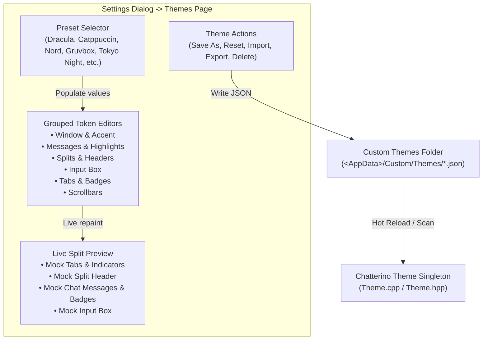
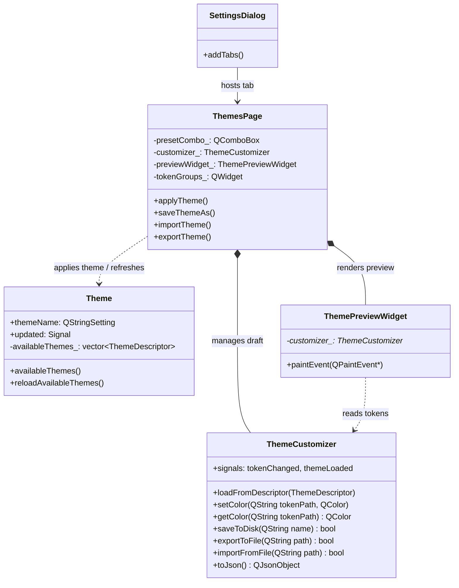

# Theme Settings Studio - Plan

<!-- Product Contract preservation: Product Contract unchanged -->

## Goal Capsule

- **Objective:** Provide a dedicated "Themes" tab in Chatterino Settings offering rich standalone preset color palettes (Dracula, Catppuccin Mocha/Macchiato/Frappé/Latte, Nord, Tokyo Night, Gruvbox Dark, One Dark, Solarized Dark/Light, Synthwave '84), granular color customization for every UI token, real-time live preview of a chat split, and full JSON import/export/persistence conforming to Chatterino's theme system.
- **Product Authority:** The Themes tab is the sole primary authority for color theme management and custom palette creation in Chatterino Settings. The simple dropdown on the General settings page remains synchronized as a secondary switch.
- **Open Blockers:** None. All core scope decisions confirmed.

---

## Product Contract

### Summary
A dedicated Themes tab in Chatterino Settings featuring a visual theme studio with granular color pickers for every UI token, bundled popular standalone palette presets, a real-time interactive preview simulating a live chat split, and JSON import/export/save capabilities directly integrated with Chatterino's theme system.

### Problem Frame
Chatterino users currently only have four built-in themes (Dark, Light, Black, White) with an optional adaptive System toggle on the General settings page. While Chatterino's backend theme engine (`Theme.cpp`) has rich support for JSON-defined custom themes with hot-reloading from `<AppData>/Custom/Themes/`, there is no in-app visual theme editor or palette browser. Users must manually create JSON files by referencing schema documentation and hex codes, creating a high barrier for customizing chat aesthetics. Adding a dedicated Themes tab with popular standalone palettes and granular color pickers empowers users to personalize their chat experience effortlessly.

### Key Decisions
- **Schema-grounded color tokens over arbitrary QSS stylesheets** (session-settled: user-approved — chosen over freeform QSS stylesheets: preserves 100% compatibility with Chatterino's native theme engine and avoids layout regressions across Qt updates). Governs R3, R4, R5.
- **Bundled presets with duplicate/save-as workflow** (session-settled: user-approved — chosen over in-place overwriting: protects bundled defaults from corruption while enabling unlimited custom user variants). Governs R2, R6.
- **Local file persistence over cloud sync** (session-settled: user-approved — chosen over cloud accounts/sync: integrates directly with Chatterino's existing local `<AppData>/Custom/Themes/` folder and hot-reloading). Governs R6, R7.

### Requirements

#### Preset Palettes
- R1. Chatterino shall ship bundled standalone palette presets including: Dracula, Catppuccin (Mocha, Macchiato, Frappé, Latte), Nord, Tokyo Night, Gruvbox Dark, One Dark, Solarized Dark, Solarized Light, and Synthwave '84, alongside existing classic themes (Dark, Light, Black, White).
- R2. Bundled presets shall be selectable from a visual preset selector or gallery within the Themes tab and apply instantly to the preview and/or application upon selection.

#### Granular Customization
- R3. The Themes tab shall provide grouped visual color pickers allowing users to inspect and customize all supported theme tokens defined in `docs/ChatterinoTheme.schema.json`.
- R4. Customization categories shall group related tokens:
  - Window & Accent (`accent`, `window.background`, `window.text`).
  - Chat Messages (`messages.backgrounds.regular`, `messages.backgrounds.alternate`, `messages.disabled`, `messages.selection`, `messages.highlightAnimationStart`, `messages.highlightAnimationEnd`, `messages.textColors.regular`, `messages.textColors.caret`, `messages.textColors.link`, `messages.textColors.system`, `messages.textColors.chatPlaceholder`).
  - Splits & Headers (`splits.background`, `splits.messageSeperator`, `splits.resizeHandle`, `splits.header.background`, `splits.header.border`, `splits.header.text`, `splits.header.focusedBackground`, `splits.header.focusedBorder`, `splits.header.focusedText`).
  - Chat Input (`splits.input.background`, `splits.input.text`, `splits.input.backgroundPulse`, `splits.input.searchHighlightBackground`, `splits.input.searchFailText`).
  - Tabs & Navigation (`tabs.regular`, `tabs.selected`, `tabs.highlighted`, `tabs.newMessage`, `tabs.liveIndicator`, `tabs.rerunIndicator`, `tabs.dividerLine`).
  - Scrollbars (`scrollbars.background`, `scrollbars.thumb`, `scrollbars.thumbSelected`).
- R5. Color pickers shall support standard RGB/HEX color selection with live update feedback.

#### Theme Management & Persistence
- R6. Users shall be able to save modified colors as a new custom theme in `<AppData>/Custom/Themes/<Name>.json` with metadata (`name`, `version`, `author`).
- R7. Users shall be able to export custom themes as standalone JSON files and import existing Chatterino theme JSON files.
- R8. Users shall be able to delete or reset custom themes, with safety confirmations.

#### Interactive Live Preview
- R9. The Themes tab shall include an embedded live preview widget simulating a realistic Chatterino split layout (channel tabs with status indicators, split header with channel name, mock chat messages with usernames, badges, system messages, highlighted text, and a mock chat input box).
- R10. Changes made in the color pickers shall update the live preview widget immediately without requiring the user to save or restart the application.

#### Settings Integration
- R11. A dedicated "Themes" tab shall be added to the Chatterino Settings dialog sidebar navigation with an appropriate icon.
- R12. The existing theme dropdown on the General settings page shall remain synchronized with theme selections made in the Themes tab.

### Key Flows

- F1. Selecting and applying a preset palette
  - **Trigger:** User opens Settings -> Themes tab and clicks on a preset (e.g., "Dracula" or "Catppuccin Mocha").
  - **Steps:** The live preview immediately reflects the preset's color palette; the token editor fields update to display the preset's color values; clicking "Apply" or "OK" sets the active theme in Chatterino.
  - **Covers:** R1, R2, R10, R11, R12.

- F2. Customizing tokens and saving a new custom theme
  - **Trigger:** User selects an existing theme or preset, adjusts one or more color tokens via the grouped color pickers, and clicks "Save As".
  - **Steps:** The live preview dynamically repaints on each color adjustment; clicking "Save As" prompts for a theme name; Chatterino validates the name, writes `<AppData>/Custom/Themes/<Name>.json` conforming to `docs/ChatterinoTheme.schema.json`, and registers the new theme in the theme list.
  - **Covers:** R3, R4, R5, R6, R9, R10.

- F3. Importing and exporting a theme file
  - **Trigger:** User clicks "Import Theme" or "Export Theme".
  - **Steps:** For import: file picker prompts for `.json` file; validates schema; copies to `<AppData>/Custom/Themes/` and activates it. For export: file picker prompts for destination; writes current active theme JSON to disk.
  - **Covers:** R7.

### Acceptance Examples

- AE1. Real-time preview response
  - **Covers:** R9, R10.
  - **Given:** The user is on the Themes tab with the Dracula preset selected.
  - **When:** The user changes `messages.backgrounds.regular` to `#1e1e2e`.
  - **Then:** The mock chat background in the live preview updates immediately to `#1e1e2e` while the actual running Chatterino chat view remains unchanged until "Apply" or "OK" is clicked.

- AE2. Preserving built-in presets
  - **Covers:** R2, R6.
  - **Given:** A bundled read-only preset (such as "Nord") is loaded.
  - **When:** The user makes adjustments and clicks "Save".
  - **Then:** The UI requires saving as a new custom theme name rather than overwriting the bundled preset file.

- AE3. Schema validity
  - **Covers:** R6, R7.
  - **Given:** A custom theme is created or imported in the Themes tab.
  - **When:** The theme file is saved to `<AppData>/Custom/Themes/<name>.json`.
  - **Then:** The JSON adheres strictly to `docs/ChatterinoTheme.schema.json` and loads without errors in `Theme::loadTheme()`.

### Visualizations



### Scope Boundaries

#### In Scope
- Full color token customization covering all tokens supported by `docs/ChatterinoTheme.schema.json`.
- Popular bundled standalone palette presets (Dracula, Catppuccin Mocha/Macchiato/Frappé/Latte, Nord, Tokyo Night, Gruvbox Dark, One Dark, Solarized Dark/Light, Synthwave '84, Dark, Light, Black, White).
- Dedicated "Themes" tab in `SettingsDialog`.
- Grouped color pickers with visual color swatches.
- Live interactive mock split preview.
- Custom theme JSON creation, naming, import, export, and deletion.

#### Outside This Product's Identity (Non-Goals)
- Arbitrary Qt Style Sheets (QSS) or CSS custom injection.
- Custom font families or font size management (already handled by Font settings).
- Cloud theme sharing, accounts, or online community theme galleries.
- Changing icon vector shapes or window border radii beyond color tokens.

### Dependencies & Assumptions
- `Theme` singleton (`src/singletons/Theme.hpp`) already monitors `<AppData>/Custom/Themes/*.json` for changes and loads themes adhering to `docs/ChatterinoTheme.schema.json`.
- `SettingsDialog` uses `addTab()` to register settings pages implementing `SettingsPage`.
- Qt provides color dialogs and custom color button widgets suitable for in-page color selection with live update feedback.

### Outstanding Questions
- None blocking planning. Minor UX details (e.g. inline palette swatches vs popup `QColorDialog` for color picker buttons) are **Deferred to Planning**.

---

## Planning Contract

### Key Technical Decisions

- KTD1. **Bundled Presets as Resource JSON Files**: Place preset themes in `resources/themes/*.json` and register them in `Theme::builtInThemes`. `generate_resources.cmake` automatically bundles them into Qt resources (`:/themes/*.json`). Cites R1, R2.
- KTD2. **Modular Color Picker Swatches with `ColorPickerDialog`**: Use `ColorButton` swatches in the token editor. Clicking a swatch opens Chatterino's native non-modal `ColorPickerDialog` (supporting HEX, RGB, HSV, and alpha), emitting live `colorChanged` signals. Avoids bulky embedded color pickers while providing full color fidelity. Cites R3, R5.
- KTD3. **State Management via `ThemeCustomizer` Model**: Introduce an in-memory `ThemeCustomizer` data model that stores working color tokens as a JSON object, performs validation against schema defaults, and dispatches change signals to the live preview. Decouples editor UI state from running application theme state until explicitly applied or saved. Cites R3, R4, R9, R10.
- KTD4. **Dynamic Theme Registry Refresh**: Add `Theme::reloadAvailableThemes()` to `Theme.hpp` and `Theme.cpp`. Allows runtime rescan of `<AppData>/Custom/Themes/` when a user creates, imports, or deletes a theme so that both the Themes tab and General page dropdown update immediately without application restart. Cites R6, R7, R8, R12.
- KTD5. **Dedicated Mock Split Live Preview Widget**: Create `ThemePreviewWidget` as a custom painting widget that draws realistic channel tabs, split header, message lines (with user badges, timestamps, system text, highlight animations, caret), and input box driven by `ThemeCustomizer`'s active palette. Cites R9, R10.

### High-Level Technical Design



### System-Wide Impact
- **Settings Dialog**: `SettingsDialog::addTabs` registers `ThemesPage` at `SettingsTabId::Themes`. General page's theme dropdown remains synchronized through `Theme::availableThemes()`.
- **Resources**: New SVG icon `resources/settings/theme.svg` and preset JSON files in `resources/themes/` are compiled into Qt resources via CMake autogen.
- **Performance**: In-memory palette manipulation in `ThemeCustomizer` only repaints the local `ThemePreviewWidget` (60 FPS fluid rendering). The global Chatterino theme is only updated when "Apply" or "OK" is triggered, avoiding unnecessary heavy application-wide repaints during fine-tuning.

### Risks & Dependencies
- **Risk**: Custom theme JSON files created by user may have invalid tokens.
  - *Mitigation*: `ThemeCustomizer` validates and defaults any missing token to `Dark.json` fallback, ensuring 100% schema compliance before saving to disk.
- **Risk**: File system naming conflicts or permission errors when saving custom themes.
  - *Mitigation*: Sanitize filename input, ensure directory exists (`Paths::themesDirectory`), and display user-friendly error banners if writing fails.

---

## Implementation Units

### U1. Preset Palette Definitions & Built-in Bundling
- **Goal:** Author and bundle all requested popular standalone color palette JSON presets and register them in the `Theme` singleton.
- **Requirements:** R1, R2.
- **Dependencies:** None.
- **Files:**
  - `resources/themes/Dracula.json`
  - `resources/themes/CatppuccinMocha.json`
  - `resources/themes/CatppuccinMacchiato.json`
  - `resources/themes/CatppuccinFrappe.json`
  - `resources/themes/CatppuccinLatte.json`
  - `resources/themes/Nord.json`
  - `resources/themes/TokyoNight.json`
  - `resources/themes/GruvboxDark.json`
  - `resources/themes/OneDark.json`
  - `resources/themes/SolarizedDark.json`
  - `resources/themes/SolarizedLight.json`
  - `resources/themes/Synthwave84.json`
  - `src/singletons/Theme.hpp`
  - `src/singletons/Theme.cpp`
- **Approach:**
  1. Author each preset JSON conforming strictly to `docs/ChatterinoTheme.schema.json`.
  2. Populate accurate, official hex colors for accents, window background/text, message regular/alternate backgrounds, text colors, tabs, and headers for all 12 presets.
  3. Add descriptors for each preset into `Theme::builtInThemes` in `src/singletons/Theme.cpp`.
- **Test scenarios:**
  - Validate each preset JSON loads successfully through `Theme::loadTheme` without throwing warnings or falling back.
  - Verify `Theme::availableThemes()` contains all 12 new presets in addition to Dark, Light, Black, and White.
- **Verification:** Unit test verifies all presets load with valid colors for accent and window background.

### U2. Dynamic Theme Registry Refresh in Theme Singleton
- **Goal:** Enable runtime reloading of custom themes in the `Theme` singleton so newly saved, imported, or deleted themes reflect immediately across the app without restart.
- **Requirements:** R6, R7, R8, R12.
- **Dependencies:** U1.
- **Files:**
  - `src/singletons/Theme.hpp`
  - `src/singletons/Theme.cpp`
- **Approach:**
  1. Add `void reloadAvailableThemes()` public method to `Theme`.
  2. Move `loadAvailableThemes` logic to repopulate `availableThemes_` while keeping `Theme::builtInThemes` intact and appending valid custom themes from `paths.themesDirectory`.
  3. Expose signal `pajlada::Signals::NoArgSignal availableThemesChanged` to notify UI dropdowns.
- **Test scenarios:**
  - Verify calling `reloadAvailableThemes()` picks up a newly placed `.json` file in the custom themes directory.
  - Verify deleting a custom file and calling `reloadAvailableThemes()` removes it from `availableThemes()`.
- **Verification:** Automated unit test adding and removing a test theme file and asserting `availableThemes()` count.

### U3. ThemeCustomizer Data Model & Serialization
- **Goal:** Create a standalone controller/model for editing theme tokens, validating schema compliance, and serializing/deserializing themes.
- **Requirements:** R3, R4, R5, R6, R7.
- **Dependencies:** U1, U2.
- **Files:**
  - `src/controllers/themes/ThemeCustomizer.hpp`
  - `src/controllers/themes/ThemeCustomizer.cpp`
  - `src/CMakeLists.txt`
- **Approach:**
  1. Implement `ThemeCustomizer` storing a working `QJsonObject` matching the schema structure.
  2. Provide getters/setters for color tokens (`setColor(const QString &path, const QColor &color)` and `getColor(const QString &path)`).
  3. Implement `loadFromDescriptor(const ThemeDescriptor &descriptor)`.
  4. Implement `saveAs(const QString &name, const QString &author)`. Writes JSON file with metadata to `<AppData>/Custom/Themes/<Name>.json` and calls `Theme::reloadAvailableThemes()`.
  5. Implement `importTheme(const QString &filePath)` and `exportTheme(const QString &destinationPath)`.
  6. Emit `tokenChanged(const QString &path, const QColor &color)` on any change.
- **Test scenarios:**
  - Modify a token, serialize to JSON, and verify the resulting JSON parses and contains the modified token.
  - Import a valid theme JSON and verify all tokens are correctly loaded into memory.
  - Validate that saving creates a schema-compliant file in the target directory.
- **Verification:** Unit tests covering token update, JSON serialization, and disk round-trip.

### U4. Real-time Live Split Preview Widget
- **Goal:** Build an interactive mock split preview widget that renders channel tabs, split header, chat messages with badges/usernames, and chat input box reflecting active customizer tokens.
- **Requirements:** R9, R10.
- **Dependencies:** U3.
- **Files:**
  - `src/widgets/settingspages/ThemePreviewWidget.hpp`
  - `src/widgets/settingspages/ThemePreviewWidget.cpp`
  - `src/CMakeLists.txt`
- **Approach:**
  1. Subclass `QFrame` / `QWidget` and connect to `ThemeCustomizer::tokenChanged`.
  2. Implement `paintEvent`:
     - Render mock channel tabs: `#streamer` (active), `#general` (regular), `#mentions` (highlighted with ping dot).
     - Render mock split header with channel title, viewer badge, and icons using `splits.header.*` colors.
     - Render mock chat area:
       - Normal message with timestamp, sub/mod badge, username, and message text (`messages.textColors.regular`).
       - Alternate row with `messages.backgrounds.alternate`.
       - Highlighted mention with `messages.highlightAnimationStart` and ping border.
       - System message with `messages.textColors.system`.
       - URL link with `messages.textColors.link`.
     - Render mock input box with placeholder and border matching `splits.input.*`.
     - Render mock scrollbar with `scrollbars.thumb`.
  3. Ensure high-DPI scaling support using Chatterino scale helpers.
- **Test scenarios:**
  - Instantiate `ThemePreviewWidget` with a `ThemeCustomizer`.
  - Trigger token color updates and verify repaint is invoked without visual artifacting or crashes.
- **Verification:** Manual visual inspection and headless widget instantiation verification.

### U5. ThemesPage Settings Dialog Tab & UI Integration
- **Goal:** Construct the full `ThemesPage` in settings with preset picker, action buttons, categorized token editors with `ColorButton` swatches, and register the page in `SettingsDialog`.
- **Requirements:** R2, R3, R4, R5, R8, R11, R12.
- **Dependencies:** U1, U2, U3, U4.
- **Files:**
  - `src/widgets/settingspages/ThemesPage.hpp`
  - `src/widgets/settingspages/ThemesPage.cpp`
  - `resources/settings/theme.svg`
  - `src/widgets/helper/SettingsDialogTab.hpp`
  - `src/widgets/dialogs/SettingsDialog.cpp`
  - `src/widgets/settingspages/GeneralPage.cpp`
  - `src/CMakeLists.txt`
- **Approach:**
  1. Create `resources/settings/theme.svg` (palette icon).
  2. Implement `ThemesPage`:
     - Top bar: preset dropdown selector, "Apply Theme" button, "Save As Custom" button, "Import", "Export", "Delete" (enabled only for custom themes).
     - Left column: scrollable grouped boxes for Window & Accent, Chat Messages, Splits & Headers, Input Box, Tabs, Scrollbars. Each token displays a label and a `ColorButton` showing current color.
     - Clicking `ColorButton` opens `ColorPickerDialog` connected to update `ThemeCustomizer` live.
     - Right column: `ThemePreviewWidget` displaying real-time rendering of current adjustments.
  3. In `SettingsDialogTab.hpp`, add `SettingsTabId::Themes`.
  4. In `SettingsDialog.cpp`, add:
     `this->addTab([]{return new ThemesPage;}, "Themes", ":/settings/theme.svg", SettingsTabId::Themes);`
  5. Connect `Theme::availableThemesChanged` to refresh the General page theme dropdown and the ThemesPage preset dropdown.
- **Test scenarios:**
  - Open Settings, select "Themes" tab; verify preset dropdown lists all presets.
  - Select "Nord"; verify preview updates to Nord colors.
  - Click a color swatch button; change color; verify preview updates immediately.
  - Click "Save As"; enter name; verify new custom theme appears in list and `<AppData>/Custom/Themes/` has the file.
- **Verification:** Interactive manual walkthrough and automated verification of tab registration.

### U6. Comprehensive Unit Testing
- **Goal:** Add comprehensive automated unit tests covering preset validation, theme reloading, JSON schema compliance, and serialization.
- **Requirements:** R1, R3, R6, R7.
- **Dependencies:** U1, U2, U3.
- **Files:**
  - `tests/src/ThemeStudio.cpp`
  - `tests/CMakeLists.txt`
- **Approach:**
  1. Test that all 12 preset JSON files exist, parse correctly, and satisfy basic color criteria.
  2. Test `ThemeCustomizer` serialization: set known tokens, serialize to `QJsonObject`, deserialize back, assert equality.
  3. Test `Theme::reloadAvailableThemes()`: add a temporary theme JSON to test themes directory, call reload, verify it appears in `availableThemes()`.
- **Test scenarios:**
  - `ThemeStudio_PresetIntegrity`: tests all presets load without warnings.
  - `ThemeStudio_SerializationRoundTrip`: tests serialization and deserialization fidelity.
  - `ThemeStudio_ReloadAvailable`: tests dynamic discovery of new theme files.
- **Verification:** Run `ninja -C build-release chatterino-test` and execute all test cases cleanly.

---

## Verification Contract

### Automated Tests
```bash
# Build the test executable
cmd.exe /c "call ""C:\Program Files\Microsoft Visual Studio\18\Community\VC\Auxiliary\Build\vcvars64.bat"" && set PATH=C:\Qt\6.8.0\msvc2022_64\bin;C:\Users\danie\.conan2\p\b\opensec3f9c676f2a9\p\bin;%PATH% && ninja -C build-release chatterino-test -j 4"

# Run tests
build-release\bin\chatterino-test.exe --gtest_filter=ThemeStudio*
```

### Manual Verification
1. Launch `build-release\bin\Chatterino Better Browser.exe`.
2. Open Settings (`Ctrl + ,`) -> Click "Themes" tab in the left sidebar.
3. Select presets (Dracula, Catppuccin Mocha, Nord, Tokyo Night, Gruvbox, Synthwave '84) and observe immediate live preview changes.
4. Modify message background color using the color swatch button and `ColorPickerDialog`. Confirm live preview reflects the change immediately.
5. Click "Save As", enter `MyCustomNord`, and confirm it appears in the theme dropdown and exists in `<AppData>/Custom/Themes/MyCustomNord.json`.
6. Click "Apply" and confirm running Chatterino main window updates its theme.

---

## Definition of Done

- All 12 popular standalone palette presets are bundled and accessible via `resources/themes/*.json`.
- `ThemesPage` is fully accessible in `SettingsDialog` under the "Themes" tab with a dedicated SVG icon.
- Token editors cover all color properties defined in `docs/ChatterinoTheme.schema.json` with visual color swatch buttons.
- Live preview widget renders mock chat, tabs, split header, and input box responding instantly to palette tweaks.
- Themes can be saved, exported, imported, and deleted with schema validation.
- All unit tests pass and application builds cleanly without warnings.
